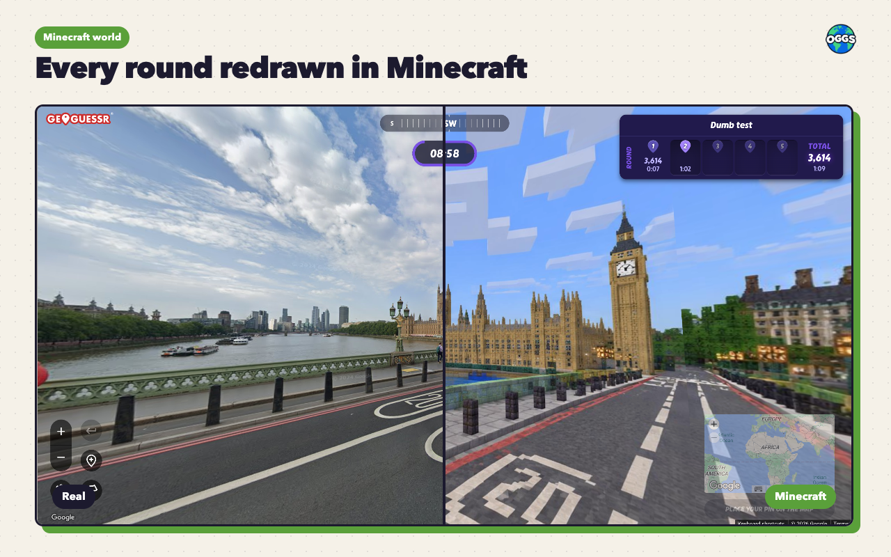
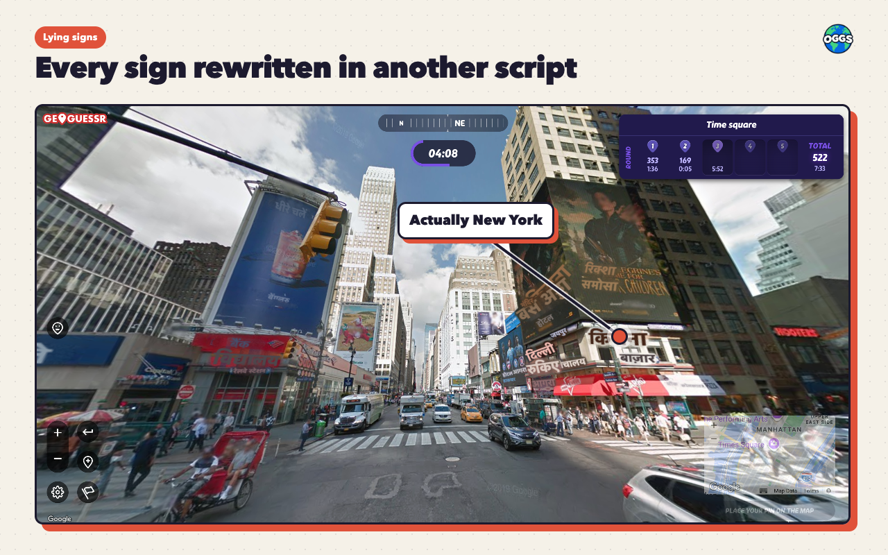
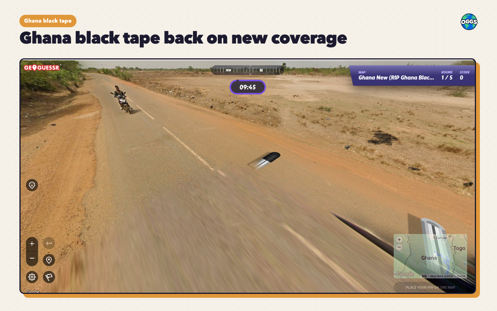
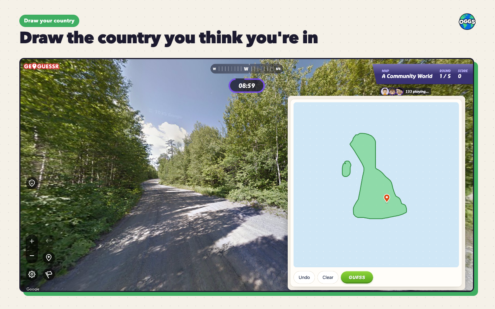
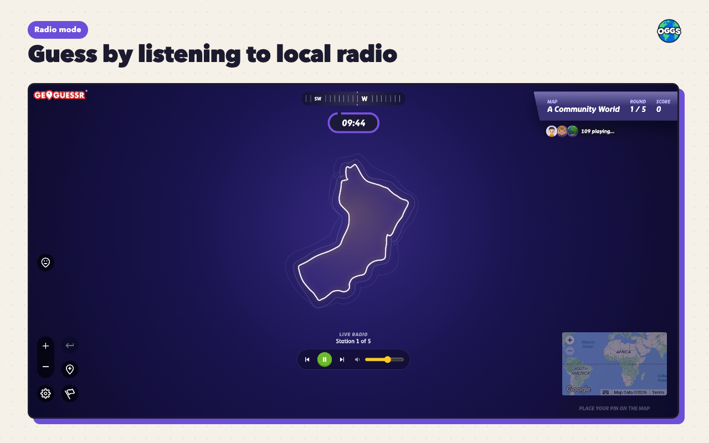

# OGGS: Orlando's GeoGuessr Scripts

> **Status:** a fun side project, maintained now and then. Live on the Chrome Web Store and as a Tampermonkey userscript. Made for singleplayer and games with friends; every script switches itself off in ranked and competitive modes.

A browser extension that bundles a few GeoGuessr scripts. Turn each one on or off from the toolbar popup.

## Install

**Easiest: the Chrome extension.** Works in Chrome, Edge, Brave, Opera and other Chromium browsers.

→ [OGGS on the Chrome Web Store](https://chromewebstore.google.com/detail/oggs-orlandos-geoguessr-s/lbnadihehgfemijnjmabooamfnppkkpa)

Click the OGGS icon in the toolbar to switch scripts on and off, then start a GeoGuessr game.

**Otherwise: the userscript.** For Firefox, or if you already use Tampermonkey.

> Note: the userscript needs a userscript manager such as [Tampermonkey](https://www.tampermonkey.net/). In Chromium browsers (Chrome, Opera, Edge, Brave…) Tampermonkey also needs your browser's Developer Mode switched on. The toggle is at the top right of `chrome://extensions`.

1. Install Tampermonkey (or Violentmonkey).
2. Open [oggs.user.js](https://raw.githubusercontent.com/Orlando-PB/OGGS/main/userscript/oggs.user.js) and click **Install**.
3. On geoguessr.com, settings are behind the yellow **OGGS** tab at the bottom left, or **Alt+O**.

Updates come automatically in both cases.

## Scripts

**Minecraft world.** Redraws the world in Minecraft.

**Lying signs.** Replaces Street View text with a set of options: another language, another script, or scrambled.

**Ghana black tape.** Adds the Ghana black tape overlay to new Ghana coverage.

**Draw your country.** Replaces the guess map with a drawing board. Draw the country you think you're in.

**Radio mode.** You hear a live local radio station from near the round's location to guess from.

All scripts switch off automatically in competitive modes. These modifiers are designed for fun and do not endorse cheating.

## Privacy

Everything runs in your browser. The only thing sent to a server is for Minecraft world: the panorama id and size, plus a random per-install id for the daily count, go to `oggs.orlandopb.com`, which fetches the panorama and calls the image API with its own key. Nothing about you or your account leaves the page.

## Help

Something broken? [Open an issue](https://github.com/Orlando-PB/OGGS/issues).
